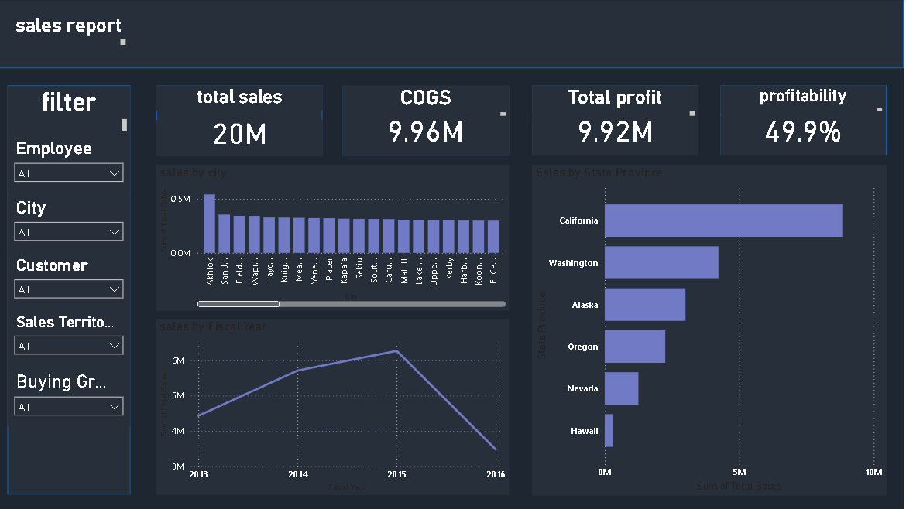

# 📊 Power BI Sales Dashboard Analysis

This is a comprehensive sales dashboard project developed using **Microsoft Power BI**. The goal of this project is to transform raw sales data into actionable insights, providing a clear overview of the company's financial performance.

## 🚀 Project Overview
This project analyzes sales data to identify key performance trends. It features an interactive dashboard that allows users to explore data through various filters, including employees, cities, customers, and sales territories.

## 🖼 Dashboard Preview

## 📈 Key Features
* **Financial KPIs:** Real-time tracking of Total Sales (20M), COGS (9.96M), Total Profit (9.92M), and Profitability (49.9%).
* **Interactive Filtering:** Ability to filter data by Employee, City, Customer, and Sales Territory.
* **Temporal Analysis:** Tracks performance across the years 2013, 2014, 2015, and 2016.

## 🛠 Tools Used
* **Microsoft Power BI:** (Data Modeling, DAX, and Dashboard Visualization).

## 📊 Key Findings
The analysis highlights the following performance metrics:
* **Total Sales:** 20M
* **COGS:** 9.96M
* **Total Profit:** 9.92M
* **Profitability Margin:** 49.9%

## 📂 File Structure
* [View Sales Dashboard PDF](Power%20Bi%20Second%20Project.pdf)

---
Created by **Ahmed Tamer**.
